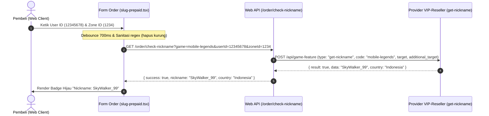

# Cek ID & Nickname Game (MLBB & Multi-Game) Guide

Skill ini mendokumentasikan panduan teknis, struktur format input, sanitasi parameter, arsitektur backend, dan best practice UX untuk fitur **Cek ID & Validasi Nickname Game** pada platform BagusPay.

---

## 1. Anatomi Input Game

Setiap game memiliki struktur identitas akun yang berbeda:

| Game | Parameter Diperlukan | Format & Panjang Karakter | Contoh Input |
| :--- | :--- | :--- | :--- |
| **Mobile Legends (MLBB)** | `userId` + `zoneId` | User ID: 6–10 digit angka<br>Zone ID: 4–5 digit angka | User: `12345678`<br>Zone: `1234` atau `(1234)` |
| **Free Fire (FF)** | `userId` | 8–10 digit angka | `1234567890` |
| **Genshin Impact** | `userId` + Server | 9–10 digit UID (server ditentukan digit awal) | UID: `800123456`<br>Server: `os_asia` |
| **PUBG Mobile** | `userId` | 8–12 digit angka | `5123456789` |
| **Honkai: Star Rail** | `userId` | 9 digit UID | `800123456` |
| **Zenless Zone Zero** | `userId` | 9–10 digit UID | `100123456` |

---

## 2. Alur Kerja & Arsitektur Sistem



---

## 3. Spesifikasi Endpoint Backend

### `GET /order/check-nickname`
- **Query Parameters**:
  - `game`: Kode game (`mobile-legends`, `free-fire`, `genshin-impact`, `pubg-mobile`, `honkai-star-rail`, `zenless-zone-zero`)
  - `userId`: User ID / Player ID / Target ID akun
  - `zoneId` *(opsional)*: Zone ID / Server ID (wajib untuk MLBB)
- **Response Format**:
  ```json
  {
    "success": true,
    "nickname": "SkyWalker_99",
    "country": "Indonesia",
    "message": "ID Game valid"
  }
  ```
- **Error Response**:
  ```json
  {
    "success": false,
    "nickname": null,
    "country": null,
    "message": "ID Game tidak ditemukan"
  }
  ```

---

## 4. Best Practice Frontend UX

1. **Auto Debounce (600–800ms)**: Jangan menembak API setiap ketikan karakter. Tunggu sampai pembeli selesai mengetik.
2. **Sanitasi Otomatis**: Pembeli sering mengetik Zone ID dengan tanda kurung (misal: `(2042)`). Selalu sanitasi dengan `.replace(/[()]/g, '').trim()`.
3. **Tombol Manual "Cek Nickname"**: Sediakan tombol cek manual di sebelah label agar pembeli dapat memicu pengecekan langsung tanpa menunggu debounce.
4. **State Visual yang Jelas**:
   - **Loading**: Spinner dengan teks *"Memeriksa User ID ke server game..."*
   - **Sukses**: Kotak hijau (`bg-emerald-500/10 border-emerald-500/30`) menampilkan nama pemain dengan font tebal dan badge region.
   - **Gagal**: Pesan merah deskriptif jika ID salah atau tidak terdaftar.
5. **Auto Disable Submit**: Jika ID game salah atau belum valid, beri peringatan sebelum transaksi dibuat untuk mencegah pesanan nyangkut/gagal di provider.

---

## 5. Lokasi Kode di Monorepo

- **Frontend Component**: `apps/web-client/app/pages/order/slug-prepaid.tsx`
- **Controller Route**: `apps/web-api/src/modules/orders/orders.controller.ts`
- **Service Logic**: `apps/web-api/src/modules/orders/services/orders.service.ts` (`checkNickname`)
- **Integration Client**: `apps/web-api/src/integrations/h2h/vipreseller/vip-reseller.service.ts` (`checkGameNickname`)
