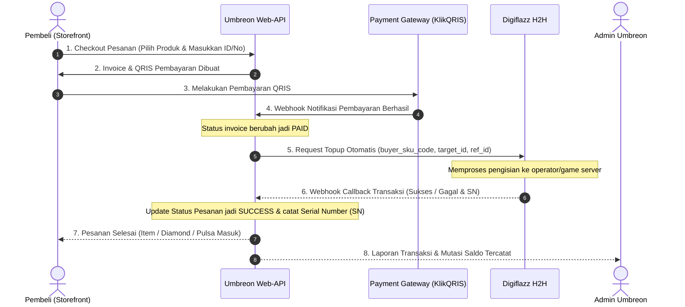

# ⚡ Panduan Integrasi Digiflazz H2H - Umbreon Store

Dokumen ini berisi panduan lengkap mengenai konfigurasi, verifikasi koneksi, import produk otomatis, hingga alur transaksi otomatis (*end-to-end*) antara **Digiflazz Provider H2H** dan sistem **Umbreon Store**.

---

## 📋 1. Ringkasan Kredensial & Konfigurasi

| Parameter | Nilai / Konfigurasi | Keterangan |
|---|---|---|
| **Provider** | Digiflazz (H2H) | [https://member.digiflazz.com](https://member.digiflazz.com) |
| **IP Whitelist VPS** | `84.247.148.122` | **Wajib didaftarkan** di Member Digiflazz |
| **Username** | `nojokaDlVZxg` | Nilai `DIGIFLAZZ_USERNAME` di `.env` |
| **API Key** | `67628e57-dada-50a2-a238-51006eaa8bb7` | Nilai `DIGIFLAZZ_API_KEY` di `.env` |
| **Callback Secret** | `67628e57dada50a2a23851006eaa8bb7` | Nilai `DIGIFLAZZ_CALLBACK_SECRET` di `.env` |
| **Webhook URL (Production)** | `https://api.umbreon.store/callback/h2h/digiflazz` | Pasang di Dashboard Digiflazz |
| **Webhook URL (Direct IP)** | `http://84.247.148.122:9991/callback/h2h/digiflazz` | Alternatif tanpa domain |
| **Mode API** | Production / Development | Sesuai jenis API Key dari Digiflazz |

---

## 🔒 2. Langkah Wajib di Dashboard Digiflazz

Sebelum transaksi dan cek saldo dapat berjalan, lakukan dua langkah berikut di dashboard Digiflazz:

### A. Daftarkan IP Whitelist VPS
1. Login ke [https://member.digiflazz.com](https://member.digiflazz.com).
2. Masuk ke menu **Pengaturan** &rarr; **Koneksi API** &rarr; **Daftar IP Whitelist**.
3. Klik **Tambah IP** dan masukkan IP server:
   ```text
   84.247.148.122
   ```
4. Simpan. Tanpa mendaftarkan IP ini, setiap request cek saldo atau order akan ditolak (*Error: IP Not Allowed*).

### B. Pasang URL Webhook / Callback
1. Masih di menu **Koneksi API** &rarr; pilih tab **Webhook / Callback**.
2. Masukkan URL Callback:
   ```text
   https://api.umbreon.store/callback/h2h/digiflazz
   ```
3. Masukkan **Secret Key**: `67628e57dada50a2a23851006eaa8bb7`.
4. Simpan perubahan.

---

## 🔍 3. Cara Cek Apakah Koneksi Digiflazz Sudah Normal

Sistem Umbreon Store telah menyediakan tombol pengecekan status live di Admin Panel:

### Cara 1: Menggunakan Widget di Header Admin (Rekomendasi)
1. Buka Admin Panel Umbreon Store di browser (`https://pepek.umbreon.store` atau `http://84.247.148.122:3333`).
2. Perhatikan navbar header bagian atas kanan, klik tombol **"Digiflazz"**.
3. Sistem akan langsung memanggil API Digiflazz secara live:
   - **Terkoneksi (Normal)**:
     - Ditandai dengan badge hijau **"Terkoneksi (Aktif)"**.
     - Menampilkan **Saldo Deposit** akun Anda saat ini (contoh: `Rp 500.000`).
     - Menampilkan IP Whitelist server Anda (`84.247.148.122`) dan URL Webhook aktif.
   - **Bermasalah / Error**:
     - Ditandai dengan badge merah dan pesan kendala langsung dari Digiflazz (misalnya: `IP belum di-whitelist` atau `Kredensial API salah`).

### Cara 2: Cek Langsung via Endpoint API
Anda juga bisa membuka endpoint ini langsung di browser atau Postman:
```http
GET https://pepek.umbreon.store/admin/providers/digiflazz/saldo
```
Response sukses:
```json
{
  "success": true,
  "data": {
    "deposit": 500000
  },
  "message": "Koneksi Digiflazz normal"
}
```

---

## 📦 4. Cara Menambahkan Item Otomatis dari Digiflazz

Anda tidak perlu menginput nama produk, harga modal, dan SKU satu per satu secara manual. Gunakan fitur **Import Provider**:

1. Di Admin Panel, buka menu sidebar **Products Prabayar**.
2. Pilih Kategori layanan (contoh: **Games**, **Pulsa**, **Voucher**, atau **PLN**).
3. Masuk ke **Sub Kategori** yang bersangkutan (misal: *Mobile Legends* atau *Telkomsel Data*).
4. Di pojok kanan atas tabel produk, klik tombol **"Add from Provider"**.
5. Modal penarik katalog Digiflazz akan terbuka secara live:
   - **Filter Brand / Tipe**: Cari nama game atau brand operator (misal `MOBILE LEGENDS`).
   - **Atur Margin Keuntungan (Profit)**:
     - Pilih **Persen (%)** (misal `5%` atau `10%`) atau **Nominal Tetap (Rp)** (misal `Rp 2.000`).
     - Harga jual ke pelanggan akan dihitung otomatis di atas harga modal Digiflazz.
   - **Pilih Ikon / Gambar**: Tentukan ikon/gambar produk.
   - **Pilih Item**: Centang produk-produk yang ingin diaktifkan di toko (atau centang semua).
   - Klik **"Simpan / Import Produk"**.
6. Semua item berhasil tersimpan ke database toko Umbreon Store lengkap dengan kode **Buyer SKU Code** Digiflazz.

### 🔄 Sinkronisasi Harga Otomatis (Update Provider Price)
Jika suatu saat ada perubahan harga modal dari pihak Digiflazz:
1. Masuk ke Sub Kategori produk.
2. Klik tombol **"Update Provider Price"**.
3. Sistem otomatis menarik harga modal terbaru dari Digiflazz dan memperbarui harga modal serta harga jual secara massal.

---

## 🔄 5. Alur Transaksi Otomatis (End-to-End Workflow)



### Penjelasan Detail Tiap Langkah:
1. **Checkout**: Pelanggan memilih produk di website depan (`umbreon.store`), memasukkan ID Game / Nomor HP tujuan.
2. **Pembayaran**: Pelanggan membayar tagihan melalui KlikQRIS (QRIS dinamis instan).
3. **Pemberitahuan Bayar**: KlikQRIS mengirim callback ke `/callback/payment/klikqris` saat pembayaran lunas.
4. **Eksekusi H2H**: Backend Umbreon Store langsung menembak API Digiflazz `POST /v1/transaction` menggunakan `buyer_sku_code` yang telah di-mapping.
5. **Callback Digiflazz**: Digiflazz mengirim status akhir (Sukses beserta No SN) ke `/callback/h2h/digiflazz`.
6. **Penyelesaian**: Status pesanan berubah menjadi `SUCCESS` dan Serial Number (SN) langsung tampil untuk pelanggan.

---

## 🛠️ 6. Troubleshooting Kendala Umum

| Kendala | Penyebab Umum | Solusi |
|---|---|---|
| **Saldo / Produk Gagal ditarik (Error 403 / Timeout)** | IP VPS belum terdaftar di whitelist Digiflazz. | Buka Member Digiflazz &rarr; daftarkan IP `84.247.148.122`. |
| **Signature Not Match / Invalid Key** | Username atau API Key di `.env` tidak sesuai akun. | Periksa `DIGIFLAZZ_USERNAME` dan `DIGIFLAZZ_API_KEY` di file `.env`. |
| **Status Pesanan Tetap Pending** | Webhook URL belum terpasang di dashboard Digiflazz. | Daftarkan `https://api.umbreon.store/callback/h2h/digiflazz` di pengaturan webhook Digiflazz. |
| **Saldo Tidak Cukup** | Deposit saldo di akun Digiflazz kurang dari harga modal item. | Lakukan topup deposit di dashboard Digiflazz. |
